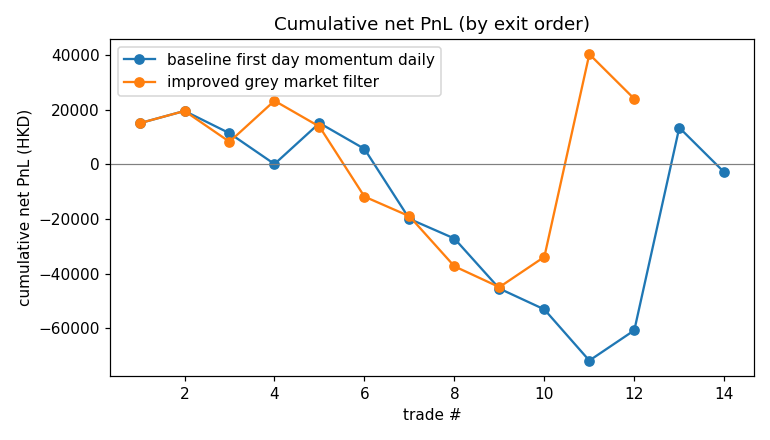
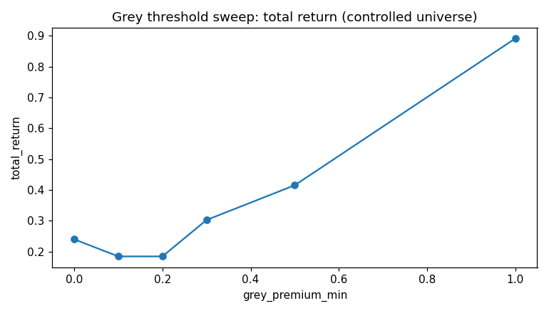
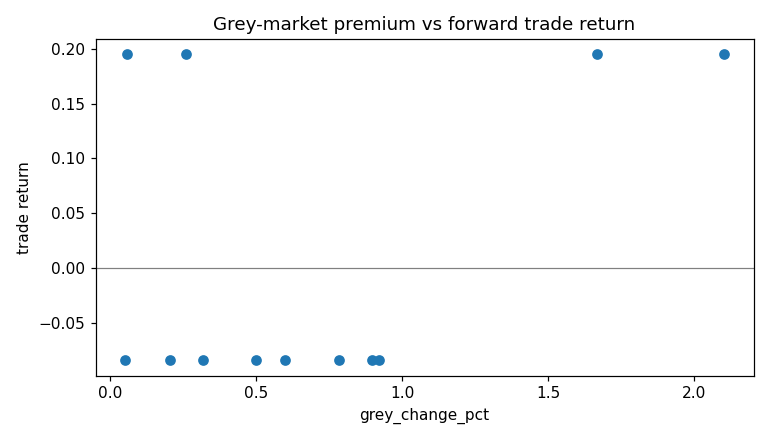

# IPO / New Listing Daily Strategy Research

> 本报告由 `python src/backtest.py` **全自动生成**（含下方 Analysis），重跑幂等、不依赖手工编辑。

## Executive Summary

> **交付物定调**：本研究的核心交付是对「首日动量 / 暗盘溢价」扣成本后**可交易性的严谨证伪**，而非虚假 alpha——三个版本扣成本后均无稳健正收益；受控阈值扫描 + Bootstrap CI + 置换检验共同表明，naive 对照的表面优势来自「能查到暗盘≈热门股」的选择效应与少数极热标的，而非暗盘溢价本身的稳健区分力（详见下方稳健性诊断与 Analysis）。

> 口径：`total_return` 为序贯等额下注的**复利**总收益；`max_drawdown` 为复利权益的**百分比**回撤（两者同源）。reversal 与 momentum 信号互斥、improved 为 baseline 的子集（叠加暗盘过滤），三者分列对照、不合并计数。`profit_factor=∞` 表示无亏损交易（`metrics.json` 中记为 `null`）。

| strategy_version                  |   trade_count |   win_rate |   total_return |   max_drawdown |   average_holding_days |   profit_factor |
|:----------------------------------|--------------:|-----------:|---------------:|---------------:|-----------------------:|----------------:|
| baseline_first_day_momentum_daily |            14 |   0.285714 |    -0.15336    |      -0.459498 |                1.14286 |        0.926291 |
| improved_grey_market_filter       |            12 |   0.333333 |     0.00935177 |      -0.409841 |                1.16667 |        1.158    |
| reversal_first_day_daily          |            27 |   0.333333 |    -0.115488   |      -0.352616 |                1.55556 |        1.04056  |

## Data

API 下载覆盖、缺失/停牌/无成交，及自行调研的 IPO/暗盘来源与可靠性（来源逐行见 `data/external/*.csv`）：

- symbol_count: 65
- daily_rows: 3673
- date_min: 20260102
- date_max: 20260615
- missing_daily_symbols: []
- duplicate_daily_keys: 0
- suspended_rows: 0
- zero_volume_rows: 1
- missing_ohlc_rows: 0
- external_symbols_total: 65
- external_grey_change_pct_present: 12
- external_grey_coverage_ratio: 0.1846
- external_ipo_subscription_present: 10
- external_ipo_coverage_ratio: 0.1538
- external_signal_symbols_total: 14
- external_grey_present_on_signals: 12
- external_grey_coverage_on_signals: 0.8571

## Strategy Definition

- Baseline：首日动量（day1 close/open-1 > 阈值，day2 open 入场，持 K 日，止损/止盈，扣费），每股票最多一笔。
- Improved：在 baseline 上叠加暗盘溢价主过滤（grey_change_pct >= 阈值），缺暗盘数据者不入场。
- Reversal（对照）：首日大跌（close/open-1 < -阈值）后预期反转，day2 open 做多，其余执行与 baseline 相同；与 momentum 互斥。
- 无未来函数：信号仅用 day1 与上市前/上市时点的外部数据（暗盘=上市前夜、超购=招股结束）；执行价用 day2 open。
- 成本（本次运行实际值）：买入 12bps、卖出 22bps、滑点 10bps、最低费 5（HKD 计；费用按成交额，最低费为每边下限）
- 出场约定：持仓窗口内逐日先判止损后判止盈（同日同时触及按止损计），含入场当日；触发即按 `stop_level`/`take_level` 价位成交（保守惯例，再叠加卖出滑点），未触发则在末个有效交易日 close 出场。
- 受控实验设计：improved_mask 只会选中『有暗盘数据』的标的，因此对该子域做暗盘阈值扫描，可把"暗盘溢价的区分力"与"数据可得性的选择效应"分离开。

## Results

### Baseline vs Improved（naive 对照）

对照表见上方 Executive Summary（improved ⊆ baseline，二者分列对照而非组合）。下图为两版本的复利权益曲线（按平仓顺序、起点 1.0）：

### Cost Sensitivity（按版本，0.5x/1x/2x 成本）

**baseline_first_day_momentum_daily**

| cost_scale   | trade_count   | win_rate           | average_return         | average_win         | average_loss         | profit_factor      | total_return         | max_drawdown         | turnover           | average_holding_days   |
|:-------------|:--------------|:-------------------|:-----------------------|:--------------------|:---------------------|:-------------------|:---------------------|:---------------------|:-------------------|:-----------------------|
| 0.5          | 14.0          | 0.2857142857142857 | -0.0021994499999999214 | 0.19748066          | -0.08207149399999988 | 0.9615991550455119 | -0.1267017262396306  | -0.4508866546673669  | 1398679.860435     | 1.1428571428571428     |
| 1.0          | 14.0          | 0.2857142857142857 | -0.004397799999999995  | 0.19496264          | -0.084141976         | 0.9262912869967744 | -0.15335985620681736 | -0.4594982767626885  | 1399040.38274      | 1.1428571428571428     |
| 2.0          | 14.0          | 0.2857142857142857 | -0.008791200000000015  | 0.18993055999999994 | -0.08827990399999999 | 0.8604144606479893 | -0.20438722338583704 | -0.48206487308523305 | 1399210.8059399999 | 1.1428571428571428     |

**improved_grey_market_filter**

| cost_scale   | trade_count   | win_rate           | average_return        | average_win         | average_loss         | profit_factor      | total_return         | max_drawdown         | turnover           | average_holding_days   |
|:-------------|:--------------|:-------------------|:----------------------|:--------------------|:---------------------|:-------------------|:---------------------|:---------------------|:-------------------|:-----------------------|
| 0.5          | 12.0          | 0.3333333333333333 | 0.011112557333333412  | 0.19748066          | -0.08207149399999988 | 1.2021086244743642 | 0.03644172338281848  | -0.40179072580993264 | 1198743.182055     | 1.1666666666666667     |
| 1.0          | 12.0          | 0.3333333333333333 | 0.008892896000000003  | 0.19496264          | -0.08414197599999998 | 1.1579969184824845 | 0.009351766597561983 | -0.409841144507665   | 1199052.7548999998 | 1.1666666666666667     |
| 2.0          | 12.0          | 0.3333333333333333 | 0.0044569173333333136 | 0.18993055999999994 | -0.08827990399999999 | 1.0756072058721735 | -0.04285288718831293 | -0.42565986574553494 | 1199246.07474      | 1.1666666666666667     |

**reversal_first_day_daily**

| cost_scale   | trade_count   | win_rate           | average_return         | average_win         | average_loss         | profit_factor      | total_return          | max_drawdown         | turnover           | average_holding_days   |
|:-------------|:--------------|:-------------------|:-----------------------|:--------------------|:---------------------|:-------------------|:----------------------|:---------------------|:-------------------|:-----------------------|
| 0.5          | 27.0          | 0.3333333333333333 | 0.0044012845282407     | 0.16362095797421738 | -0.07520855219474763 | 1.0876815182568291 | -0.058766189315523354 | -0.33653696865276206 | 2698859.6054249993 | 1.5555555555555556     |
| 1.0          | 27.0          | 0.3333333333333333 | 0.002095395986207326   | 0.16097486891255702 | -0.07734434047696753 | 1.0405638737031024 | -0.11548809548811867  | -0.3526158724384677  | 2699261.2546899994 | 1.5555555555555556     |
| 2.0          | 27.0          | 0.3333333333333333 | -0.0025118378919723496 | 0.1556888346966277  | -0.08161217418627238 | 0.953547668991779  | -0.21912705070467786  | -0.3884514498839292  | 2698969.23414      | 1.5555555555555556     |

### 受控实验：暗盘阈值扫描（仅作用于暗盘可得域）

| grey_premium_min   | trade_count   | win_rate   | average_return   | total_return   | profit_factor   |
|:-------------------|:--------------|:-----------|:-----------------|:---------------|:----------------|
| 0.00               | 12.0          | 0.3333     | 0.0089           | 0.0094         | 1.158           |
| 0.10               | 10.0          | 0.3        | -0.0004          | -0.0777        | 0.9923          |
| 0.20               | 10.0          | 0.3        | -0.0004          | -0.0777        | 0.9923          |
| 0.30               | 8.0           | 0.25       | -0.0144          | -0.1573        | 0.7724          |
| 0.50               | 7.0           | 0.2857     | -0.0044          | -0.0799        | 0.9269          |
| 1.00               | 2.0           | 1.0        | 0.195            | 0.4279         | ∞               |

### 稳健性诊断（Bootstrap 95% CI + 置换检验）

> CI 越宽=点估计越不可信；选股 p 越大=该因子选股不比随机选同等数量更好（疑过拟合/噪声）。

| version                           | total_return   | 95% CI           | 选股 p   |
|:----------------------------------|:---------------|:-----------------|:-------|
| baseline_first_day_momentum_daily | -15.3%         | [-61.9%, 88.1%]  | —      |
| improved_grey_market_filter       | 0.9%           | [-54.6%, 124.2%] | 0.507  |
| reversal_first_day_daily          | -11.5%         | [-69.8%, 197.6%] | —      |

### 多重检验 / Data-snooping 稳健性

> 校正"在多个策略×门槛配置里挑最好"的选择偏差——本研究唯一仍敞着的过拟合口子。N 为保守下界（不含历史已移除的 multifactor，计入则惩罚更重）。

| 检验                              | 值     | 含义                                      |
|:--------------------------------|:------|:----------------------------------------|
| max-statistic 置换 p（White RC 风格） | 0.138 | 最佳档 total_return=42.8% 在 9 个配置多重比较下的显著性 |
| Holm 最小校正 p                     | 0.396 | 各门槛单独置换 p 经 Holm step-down 后的最小值        |
| Deflated Sharpe Ratio           | 0.000 | improved 12 笔；N=9 试验校正后 Sharpe 是否显著     |

**校正后最佳策略不显著**：试了多个策略×门槛后挑出的表观最优，可由 data-snooping（多重试验后选最好）解释——进一步坐实本样本无稳健 alpha。

### 暗盘溢价分层 + 相关性

| bucket        |   count |   avg_return |
|:--------------|--------:|-------------:|
| (0.0525, 0.3] |       4 |    0.0554103 |
| (0.3, 0.821]  |       4 |   -0.084142  |
| (0.821, 2.1]  |       4 |    0.0554103 |

Spearman(grey_change_pct, return) = -0.1189

### IPO 特征分层（按公开超购倍数）

| bucket            |   count |   avg_return |
|:------------------|--------:|-------------:|
| (53.399, 1837.0]  |       4 |    0.0554103 |
| (1837.0, 4068.0]  |       3 |    0.0088929 |
| (4068.0, 9015.11] |       3 |    0.0088929 |

## Analysis

- **Baseline**：14 笔，胜率 28.6%，总收益 -15.34%，profit_factor 0.93。
- **Improved（暗盘溢价≥0）**：12 笔，胜率 33.3%，总收益 0.94%，profit_factor 1.16。
- **Reversal（首日大跌后反转，对照）**：27 笔，胜率 33.3%，总收益 -11.55%，profit_factor 1.04。
- **受控实验（暗盘阈值扫描，仅暗盘可得域）**：门槛由 0.00 提到 1.00 时，平均单笔收益由 0.89% → 19.50%（首尾上升），样本由 12 → 2 笔。但收益随门槛**并非单调**、最高门槛仅剩 2 笔（**尾部驱动**），全样本 Spearman=-0.12；受控域内暗盘溢价的稳健区分力**有限**，naive 对照的优势更多来自『能查到暗盘数据≈热门股』的选择效应与少数极热标的。
- **暗盘溢价与前向收益的 Spearman 相关 = -0.12（负相关）**。

## Limitations（必须正视）

- **单一普涨窗口**：数据覆盖 2026 上半年，期间港股新股近乎全线上涨；任何"选更热标的"的规则都天然占优，外推性存疑。
- **样本极小**：baseline/improved 各为个位数到十余笔，胜率/收益的置信区间很宽，易过拟合。
- **选择偏差已缓解但未消除**：暗盘数据覆盖 12/14 信号标的，受控阈值扫描即为消除"数据可得性混入"而设；但仍有 2 支偏冷标的无公开暗盘数据被动排除。
- **外部数据口径**：个别暗盘值为近似（如"升幅超五成"取 0.50），部分超购为孖展口径（已在 `source_note` 标注）。
- **数据出处**：lab 日线为真实港股市场数据（coverage_start 与公开上市日一致）；外部暗盘/IPO 为自行调研公开来源，每行记 source_url。

## Next Steps

- 把暗盘数据补全到全部信号标的（含偏冷股），彻底消除选择偏差。
- 暗盘/超购阈值改为按上市月或行业的 expanding 分位，去除横截面假设。
- 多因子打分（暗盘 + 超购 + 行业）替代单一阈值过滤。
- 扩到多年、多市场状态做样本外验证，检验"暗盘溢价 → 初期动量"是否跨期稳健。
